# Moonarr 


<div align="center">
    <picture style="margin-left: 8px">
    <source media="(prefers-color-scheme: dark)" srcset="./public/images/moonarr-dark-1200.webp">
    <source media="(prefers-color-scheme: light)" srcset="./public/images/moonarr-light-1200.webp">
    &nbsp;
    </picture>
</div>

---


<!-- Put after theses lines, ctrl + shift + p and write "Markdown" and click to "Markdwon all ine one" extension -->

- [Moonarr](#moonarr)
- [👤 Biography](#-biography)
  - [🪪 Why is it called Moonarr ?](#-why-is-it-called-moonarr-)
  - [🎯 Our goal](#-our-goal)
  - [🖼️ Our Logo](#️-our-logo)
  - [🆕 Versions](#-versions)
- [🦾 Which technologies and packages does it use ?](#-which-technologies-and-packages-does-it-use-)
  - [🧩 Framework](#-framework)
    - [⚛️➡️ Next.js](#️️-nextjs)
  - [📦 Packages](#-packages)
    - [🌊 Tailwind CSS](#-tailwind-css)
    - [🆔 NextAuth.js](#-nextauthjs)
    - [📝 Lexkit](#-lexkit)
    - [💠 ShadcnUi](#-shadcnui)
    - [💠 JollyUi](#-jollyui)
- [🏁 Getting Start](#-getting-start)
  - [📋 PREREQUISITES](#-prerequisites)
  - [👨‍🎓 How to use](#-how-to-use)
    - [🌐 HomePage and Login](#-homepage-and-login)
    - [✍🏻 Edition Page](#-edition-page)
  - [✨ Features](#-features)
    - [📝 Readme Editor](#-readme-editor)
      - [💅 Text formatting](#-text-formatting)
      - [⌨️ Shortcut key](#️-shortcut-key)
    - [😊 Emoji Picker](#-emoji-picker)
    - [🛍️ Marketplace](#️-marketplace)
      - [🗃️ Module](#️-module)
      - [➕ Module Insertion View ~ Edit](#-module-insertion-view--edit)
    - [📤 Push directly to your profile](#-push-directly-to-your-profile)
    - [📥 Export Markdown File](#-export-markdown-file)
- [🚧 Development \& Deployment](#-development--deployment)
  - [⚙️ Configuration](#️-configuration)
    - [🐙 Create your GitHub Provider](#-create-your-github-provider)
    - [🔏 Environment file](#-environment-file)
  - [👨‍💻 Local Development](#-local-development)
    - [🎭 Clone the repository](#-clone-the-repository)
    - [📁 Move to Folder and install dependencies](#-move-to-folder-and-install-dependencies)
    - [👾 Solve vulnerabilities](#-solve-vulnerabilities)
    - [🎛️ Follow back the configuration step](#️-follow-back-the-configuration-step)
    - [🕹️ Run the project](#️-run-the-project)
  - [🚀 Deployment](#-deployment)
    - [🏷️ Get The Image](#️-get-the-image)
    - [🔄 Docker Run](#-docker-run)
- [🗪 FAQ and known issues](#-faq-and-known-issues)
  - [What's happens if i don't have a readme profile project ?](#whats-happens-if-i-dont-have-a-readme-profile-project-)
  - [What does i need to do if after repository creation and pushing modification, my readme won't load to my profile ?](#what-does-i-need-to-do-if-after-repository-creation-and-pushing-modification-my-readme-wont-load-to-my-profile-)
  - [Why does when i create a project from scratch using Moonarr, add content and click to push, the project GitHub was created but without `README.md` (and so it doesn't showed in my profile) ?](#why-does-when-i-create-a-project-from-scratch-using-moonarr-add-content-and-click-to-push-the-project-github-was-created-but-without-readmemd-and-so-it-doesnt-showed-in-my-profile-)
  - [Why does when i switch to another tabs, and come back to moonarr, all my changes are reset ?](#why-does-when-i-switch-to-another-tabs-and-come-back-to-moonarr-all-my-changes-are-reset-)
  - [How can I suggest a new module ?](#how-can-i-suggest-a-new-module-)

# 👤 Biography

Moonar is an open-source website, to help user to customize his own profile readme, without writing any markdown line !

## 🪪 Why is it called Moonarr ?

This project is called Moonarr because the Moon is a beautiful and powerful entity.

>[!TIP]
> Also because design a Moon is easier than an octopus 😉

## 🎯 Our goal

Our goal with this website is to provide for anyone a solution to get a beautiful Readme for your profile, easier than expected. 🔥
>[!NOTE]
> ⭐️ Doesn't forget to give a star if your like this project ! ⭐️

## 🖼️ Our Logo

| dark mode | light mode |
| :--: | :--: |
|  |  | 

Theses logos are made with ❤️ using **Adobe Illustator**

## 🆕 Versions

Moonarr version use [Semantic Versioning](https://semver.org/) format.

>[!NOTE]
> Moonarr version <1.0.0 is an Alpha and under developement

# 🦾 Which technologies and packages does it use ?


## 🧩 Framework 

### ⚛️➡️ Next.js
Next.js is an open-source framework, powered by ⚛︎ React.js and node.js.
[Next Documentation here](https://nextjs.org/docs)

## 📦 Packages

### 🌊 Tailwind CSS
Tailwind CSS is a CSS framework for rapidly building modern websites without ever leaving your HTML.
[Tailwind CSS Documentation here](https://tailwindcss.com/docs)

### 🆔 NextAuth.js
Next-auth is an open-source authentication librabry designed for next.js. Its goal here is to give microsoft entra id authentication.
[NextAuth.js Documentation here](https://next-auth.js.org/getting-started/introduction)

### 📝 Lexkit
Lexkit is a Rich text package, with shortkey, text formatting and HTML and Readme handler.
[Lexkit Documentation here](https://lexkit.dev/docs/introduction)

### 💠 ShadcnUi
Shadcnui is a set of many customizable components.
[Shadcnui Documentation here](https://ui.shadcn.com/docs/installation)

### 💠 JollyUi
JollyUi is a set of many customizable Shadcnui Based components.
[Jollyui Documentation here](https://www.jollyui.dev/docs)

# 🏁 Getting Start

## 📋 PREREQUISITES

No prerequisites needed ! Just a GitHub account 😉

## 👨‍🎓 How to use

>[!NOTE]
> All incommming screenshot are take with version 0.4.0, it might be a little bit different of your view.

### 🌐 HomePage and Login

1. Go to [Moonarr Website](https://moonarr.vercel.app)

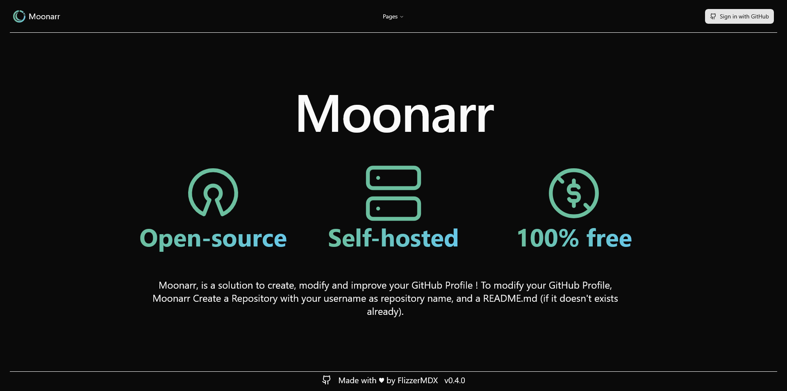

2. Click at the top right corner and Sign In with your GitHub Credentials

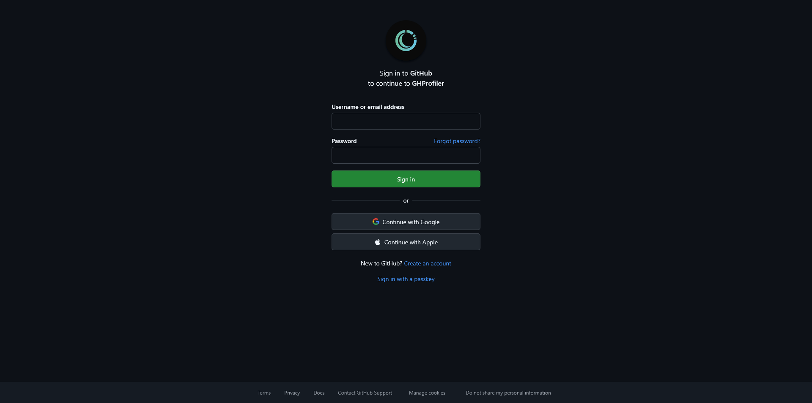

>[!NOTE]
>If it's the first time you login to this application, you need to accept asked rights.
>
>Theses rights is useful to use this application. One of the main features need your accessToken, with ability to write and create repository GitHub.
>
> 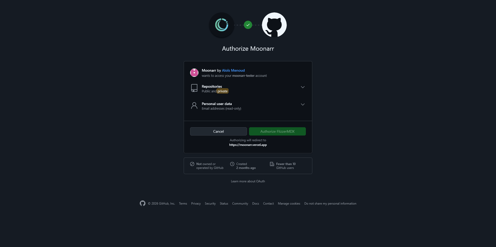

3. If you are not already, go to the [Edit page](https://moonarr.vercel.app/edit)

### ✍🏻 Edition Page

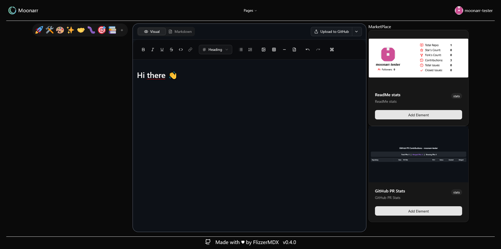

This is the Edition page. With this page, we have a lot of feature to help to modify and improve your README.md
- [Emoji Picker](#-emoji-picker)
- [Marketplace Module](#️-marketplace)
- [Text formatting](#-text-formatting)
- [Shortcut key](#️-shortcut-key)
- [Download README](#-export-markdown-file)
- [Push README to your GitHub Profile](#-push-directly-to-your-profile)

We can split this view in three part as below.

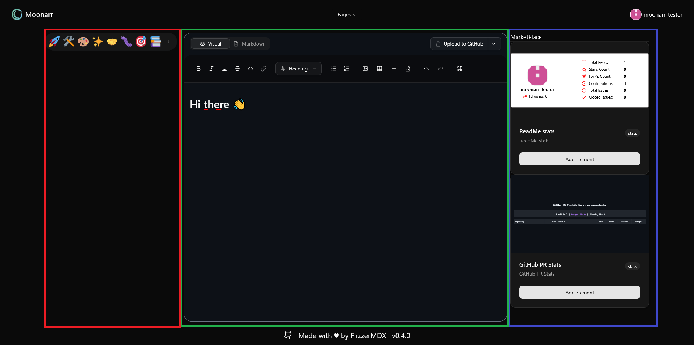

| Red Section | Green Section | Blue Section |
| :--: | :--: | :--: |
| [Emoji Picker](#-emoji-picker) | [Edition and Preview](#-readme-editor) | [Marketplace](#️-marketplace) |

## ✨ Features

### 📝 Readme Editor

#### 💅 Text formatting

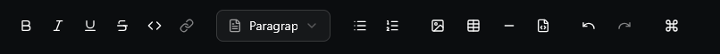

There is a lot of text formatting (without writing in markdown). Follow to previous image (from left to right):

- Bold
- Italic
- Underline
- Stroke
- Inline Code
- Link (here is disabled because it need selected text to be enabled)
- Paragraph (choose between paragraph and different titles type)
- Bullet list
- Numbered list
- Image (From Url only - online image)
- Table
- Horizontal Separation
- HTML Embed (not recommanded to beginner)

Next ones is useful but there is not text formatting. Theses are explained in [Shortcut key](#️-shortcut-key) section

>[!NOTE]
> Block code is missing, it will be added in the future

#### ⌨️ Shortcut key

As explained in [Text formatting](#-text-formatting) section, there are several other button in the toolbar

- Undo ~ `Ctrl + Z` (Remove last changes)
- Redo ~ `Ctrl + Y` (Add back last removed changes)
- Command Palette ~ `Ctrl + Shift + P` (Open help guide for command chortcut key)

Others shortcut key can be find in the Command Palette

### 😊 Emoji Picker

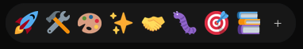

Emoji Picker ~ Close View

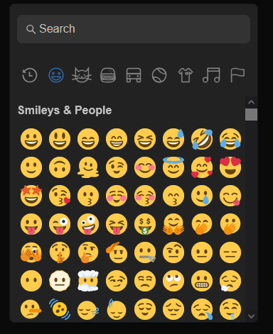

Emoji Picker ~ Open View

The Emoji Picker will help you to find the best emoji to rich your texts. You can use the search bar, or also use the categories. Simply click to an emoji to add it to the editor.

### 🛍️ Marketplace

Marketplace is an aera with a lot of module, that you can add to your readme.

#### 🗃️ Module

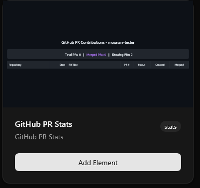

#### ➕ Module Insertion View ~ Edit

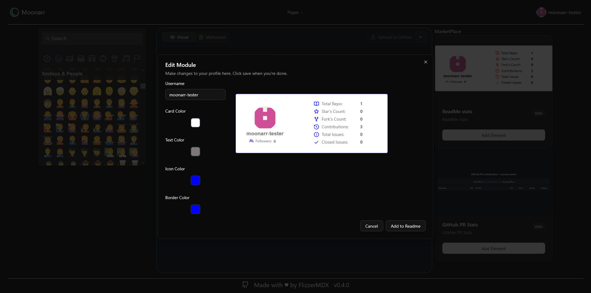

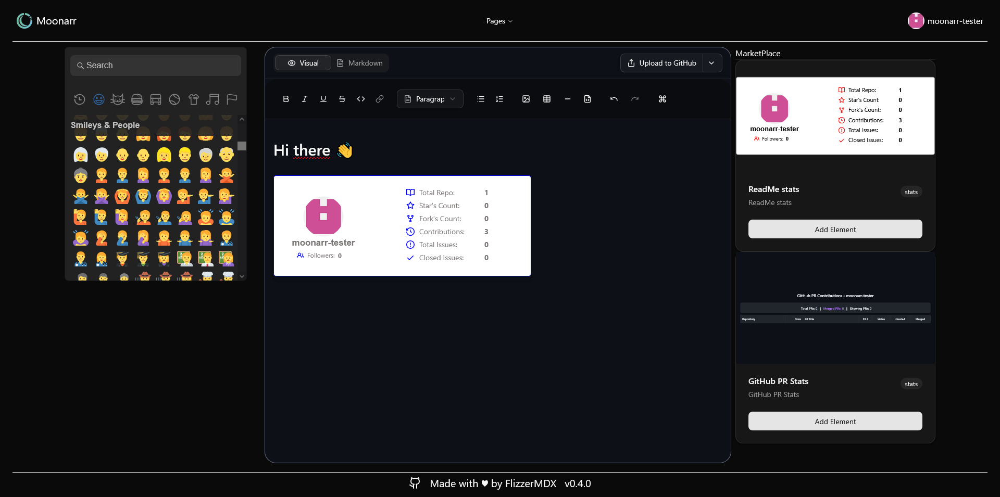

### 📤 Push directly to your profile

### 📥 Export Markdown File

# 🚧 Development & Deployment

## ⚙️ Configuration

### 🐙 Create your GitHub Provider
1. Go to [GitHub](https://github.com)
2. Go to Settings
3. Scroll down to Developer settings and click
4. Next, click to OAuth Apps -> New OAuth App
5. Put your Application name
6. Put your Homepage URL
7. Put the Authorization callback URL, which is your **hostname** with `/api/auth/callback/github` at the end, so for example for **moonarr** (https://moonarr.vercel.app), it's `https://moonarr.vercel.app/api/auth/callback/github`
8. CONFIRM
9. Keep the client ID
10. Generate a new client secret and keep it, we need client ID and client secret later.

>[!TIP]
> It's recommanded to have different OAuth App for each stages : production, test, development...

### 🔏 Environment file

1. Clone or rename `.env.example` to `.env`
2. Add required values : 
   - `AUTH_GITHUB_CLIENT_ID`, the client id for your GitHub Provider 
   - `AUTH_GITHUB_CLIENT_SECRET`, the client id for your GitHub Provider 
   - `NEXTAUTH_URL`, The URL of your application. http://localhost:3000 if you run locally for example.
   - `NEXTAUTH_SECRET`, make `npx auth` or `openssl rand -base64 32`
>[!NOTE]
> The client id and client secret of your GitHub Provider is the both one generated at the previous step

## 👨‍💻 Local Development

### 🎭 Clone the repository

```sh
git clone https://github.com/FlizzerMDX/Moonarr.git
```

### 📁 Move to Folder and install dependencies

Move to Moonarr
```sh
cd Moonarr
```

Install dependencies
```sh
npm i
```
>[!NOTE]
> `npm i` stand for `npm install`. Both command running and do the same thing

### 👾 Solve vulnerabilities

Get Vulnerabilities
```sh
npm audit
```

Solve vulnerabilities if necessary
```sh
npm audit fix
```

>[!TIP]
> Sometimes, `npm audit fix` isn't enough, and you need to do `npm audit fix --force`, or to change some dependencies, but BE CAREFUL ! It could break compatibility so be aware.

### 🎛️ Follow back the configuration step

You need to do the [configuration](#️-configuration) step before continue.

### 🕹️ Run the project

Now, you can run the project with the following command
```sh
npm run dev
```

## 🚀 Deployment

The best way to deploy this project, is to use its image from `Dockerhub` or `GitHub Registry`.

### 🏷️ Get The Image

`Dockerhub`
```
docker pull flizzermdx/moonarr:latest
```

`GitHub Registry`
```
docker pull ghcr.io/flizzermdx/moonarr:latest
```

### 🔄 Docker Run

```
docker run --name moonarr -p 3000:3000 -d flizzermdx/moonarr:latest
```
>[!NOTE]
> You can replace `flizzermdx/moonarr:latest` to `ghcr.io/flizzermdx/moonarr:latest` if you wanna use image from GitHub Registry
> You can also replace `latest` for version you wanna run


# 🗪 FAQ and known issues

## What's happens if i don't have a readme profile project ?

No worries ! If you don't have the project named like your username for example with me `FlizzerMDX/FlizzerMDX`, with a README.md inside, it's ok ! When you'll be in the /edit page, a message will pop-up and ask you if you wanna create it from scratch or a file

## What does i need to do if after repository creation and pushing modification, my readme won't load to my profile ?

It seems to be an issue from GitHub.
Go to your repository which named like your username for example with me `FlizzerMDX/FlizzerMDX`.
After that, check the message at the top right corner. It suggest to show to your profile. Click

## Why does when i create a project from scratch using Moonarr, add content and click to push, the project GitHub was created but without `README.md` (and so it doesn't showed in my profile) ?

It's a know issue, we work on it.
Currently, backend is developed to work only with a readme with content. So modify existing readme or creating a new project from a file will run.

Issue : [#7](https://github.com/FlizzerMDX/Moonarr/issues/7)

## Why does when i switch to another tabs, and come back to moonarr, all my changes are reset ?

It's a know issue, we work on it.

Issue : [#8](https://github.com/FlizzerMDX/Moonarr/issues/8)

## How can I suggest a new module ?

Good question !

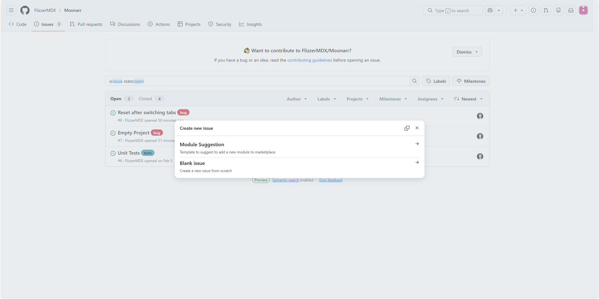

You can go to the [issue](https://github.com/FlizzerMDX/Moonarr/issues) page, click to "New issue", and select "Module Suggestion"

| Raw Text | Preview |
| :--: | :--: |
| 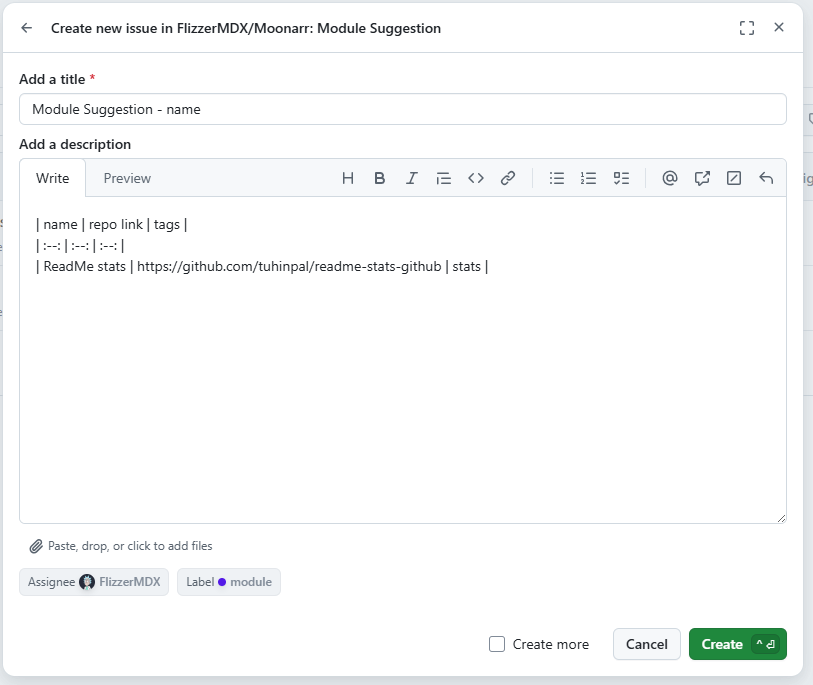 | 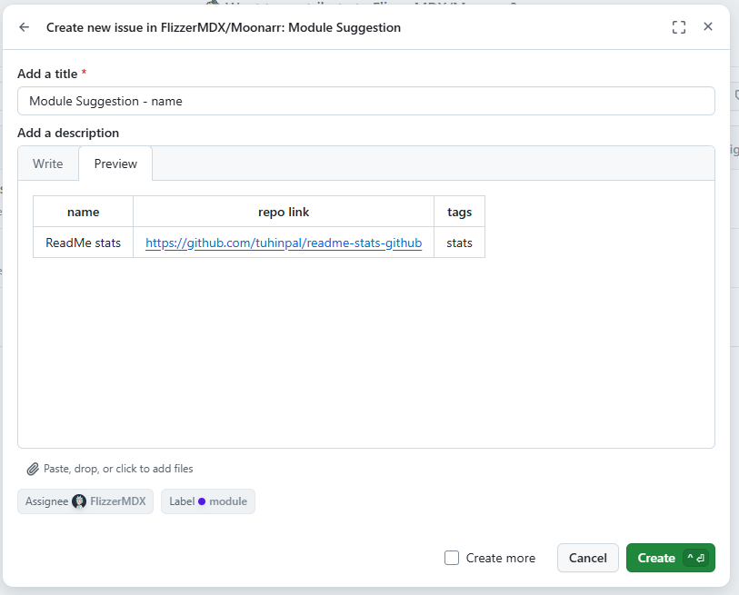 | 

As you can see to theses screenshots, you get the left view with text that you need to modify, here are the following:

- Title : change online the "name"
- In the table, change values in the last raw. If you want to suggest more than one module, add a row next to the latest.

After that, be careful to watch the preview before creating issue, to check if values are visible and if the table is correctly showed as the right screenshot. If it's not and you create it, no worries, just edit it.